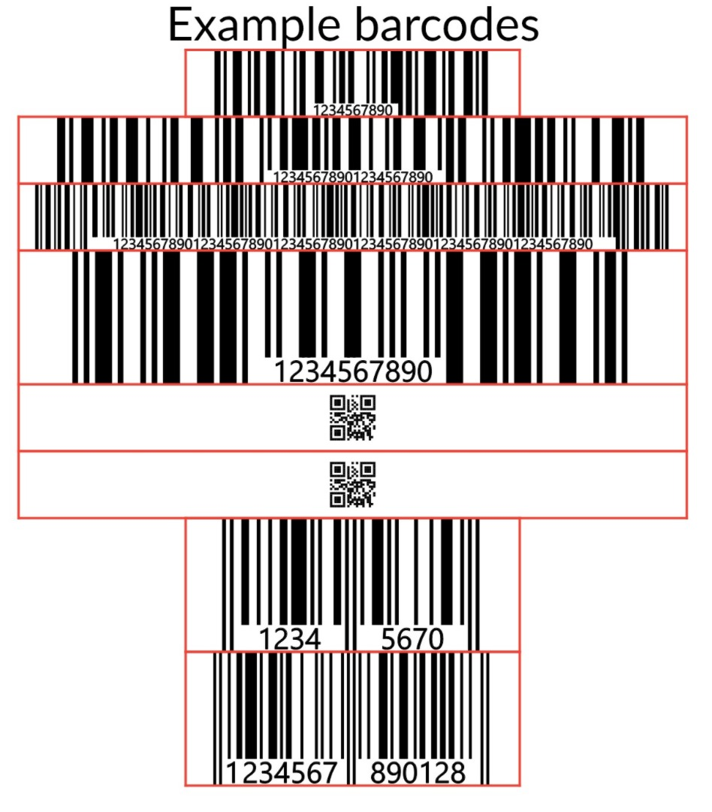

# QuestPdf.Barcodes

[](https://www.nuget.org/packages/QuestPdf.Barcodes/)

`QuestPdf.Barcodes` is a C# library that extends the functionality of [QuestPDF](https://www.nuget.org/packages/QuestPDF/) by integrating barcode generation using [Barcoder](https://www.nuget.org/packages/Barcoder/). This package allows you to easily add various types of barcodes to your PDF documents.

## Features

- Generate Code128, QR Codes, and many other barcode formats.
- Seamless integration with QuestPDF.
- Simple and intuitive API.

## Installation

You can install the package via NuGet Package Manager:

```sh
dotnet add package QuestPdf.Barcodes
```

Or via the NuGet Package Manager in Visual Studio:

1. Right-click on your project in Solution Explorer.
2. Select "Manage NuGet Packages..."
3. Search for "QuestPdf.Barcodes" and install the package.

## Generated barcodes



## Usage

Here is a basic example of how to use `QuestPdf.Barcodes` to add a barcode to a PDF document:

```csharp
using QuestPDF.Fluent;
using QuestPDF.Helpers;
using QuestPDF.Infrastructure;
using QuestPDF.Previewer;

var document = Document.Create(container =>
{
  container.Page(page =>
  {
    page
      .Content().Column(column =>
      {
        column.Item()
          .AlignCenter()
          .Border(1)
          .Height(2, Unit.Centimetre)
          .Width(10, Unit.Centimetre)
          .BarcodeTwoToFive("1234567890", true, false);

        column.Item()
          .AlignCenter()
          .Height(4, Unit.Centimetre)
          .Width(4, Unit.Centimetre)
          .BarcodeQr("1234567890");
      });
  });
});
document.ShowInPreviewer();
```

## Supported Barcode Types

`QuestPdf.Barcodes` supports the following barcode types (provided by Barcoder):

- Aztec
- Codabar
- Code128
- Code39
- Code93
- Data Matrix
- EAN-13
- EAN-8
- Kix
- PDF417
- QR Code
- Royal Mail
- (Interleaved)2of5
- UPC-A
- UPC-E

## Contributing

Contributions are welcome! If you have any ideas, suggestions, or issues, feel free to create an issue or submit a pull request.

## License

This project is licensed under the MIT License - see the [LICENSE](LICENSE) file for details.

## Acknowledgements

- [QuestPDF](https://github.com/QuestPDF/QuestPDF) - A comprehensive library for generating PDF documents in C#.
- [Barcoder](https://github.com/huysentruitw/barcoder) - A library for generating various types of barcodes.
- [SvgLib](https://github.com/huysentruitw/svglib) - A library for generating svg code.

## Contact

If you have any questions or need further assistance, feel free to reach out via the issues section.
